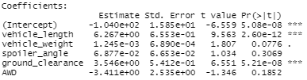
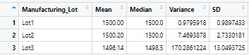
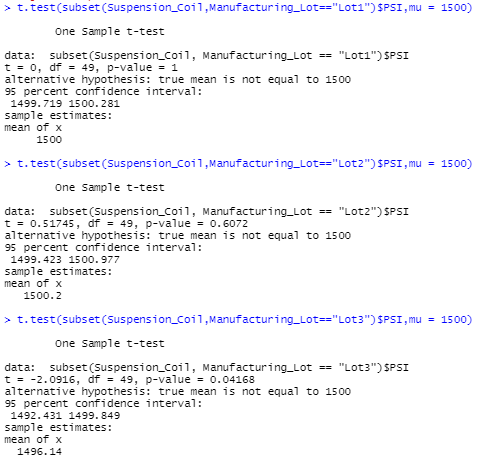

# MechaCar_Statistical_Analysis

## Linear Regression to Predict MPG
*Which variables/coefficients provided a non-random amount of variance to the mpg values in the dataset?
     *Vehicle weight, spoiler angle, and AWD all had p-values supporting a non-random variance given the data below



*Is the slope of the linear model considered to be zero? Why or why not?
     *Because we have a significant relationship between some variables, with p-value of 5.35e-11, the slope is not zero.

*Does this linear model predict mpg of MechaCar prototypes effectively? Why or why not?
     *The R-squared values are 71% and 68% (adjusted). These being closer to 100% than 0% tells us the data is directionally correct and a good model but may not tell the whole story.


## Summary Statistics on Suspension Coils
*The design specifications for the MechaCar suspension coils dictate that the variance of the suspension coils must not exceed 100 pounds per square inch. Does the current manufacturing data meet this design specification for all manufacturing lots in total and each lot individually? Why or why not?
     *The variance in the Suspension_Summary show a var of 62.3, which is less than the 100 pound exception, with lot_Summary showing lots 1 and 2 having a var 1 and 7.5 (in line w/ specs) and lot 3 having a var of 170 (not in line with specs).



## T-Tests on Suspension Coils
*Briefly summarize your interpretation and findings for the t-test results. Include screenshots of the t-test to support your summary.
     *T-Test data is below, showing lots 1 and 2 with p-values of 1 and .6 respectively, with means of at 1500 and 1500.2. This means that becaus the means are ~1500 and p-values are significantly higher than .05 there would not be an indication of significant statistical difference in these subsets. Lot 3 has a p-value of .04 with a mean of 1496, so this group would indicate a significant statistical difference.
    
 

## Study Design: MechaCar vs Competition
*Write a short description of a statistical study that can quantify how the MechaCar performs against the competition. In your study design, think critically about what metrics would be of interest to a consumer: for a few examples, cost, city or highway fuel efficiency, horse power, maintenance cost, or safety rating.
In your description, address the following questions:
What metric or metrics are you going to test?
What is the null hypothesis or alternative hypothesis?
What statistical test would you use to test the hypothesis? And why?
What data is needed to run the statistical test?
     *A statistical study of interest to consumers evaluativing competitors to MechaCar wouuld look at safety rating and cost across similar styles of vehicle. The null hypothesis would be that cost and safety rating among similar competitors is the same, and the alternative hypothesis would be that the cost and safety ratings among similar cometitors are different. I would use a similar t-test aproach, as we can set up analysis and assess p-values to determine the answers to our hypothesis.I would need cost and safety rating data for as many similar competitive vehicles to MechCar as I could find, along with that data for MechaCar.

```bash
Kyle Schneider, 12/20/2020
```

